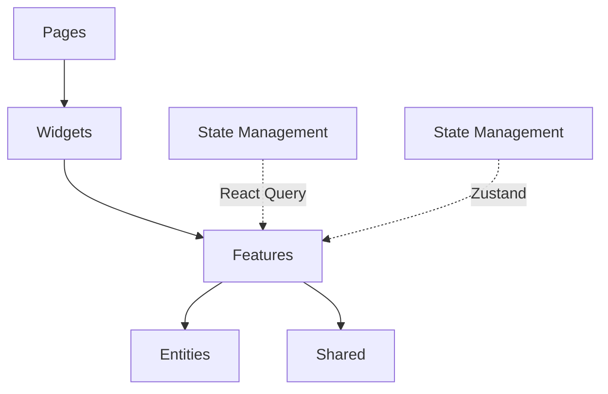
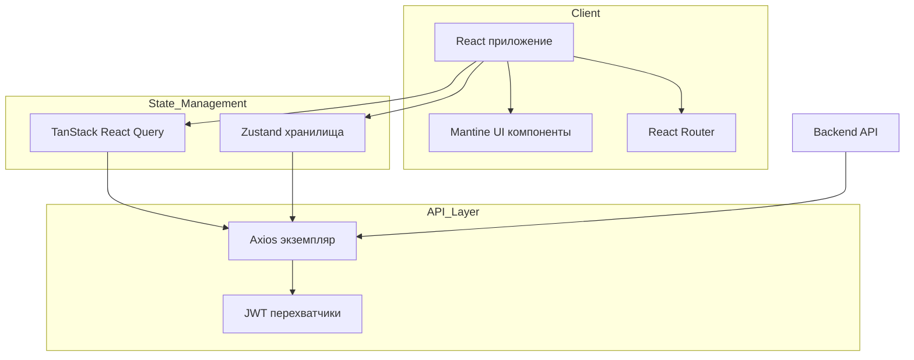
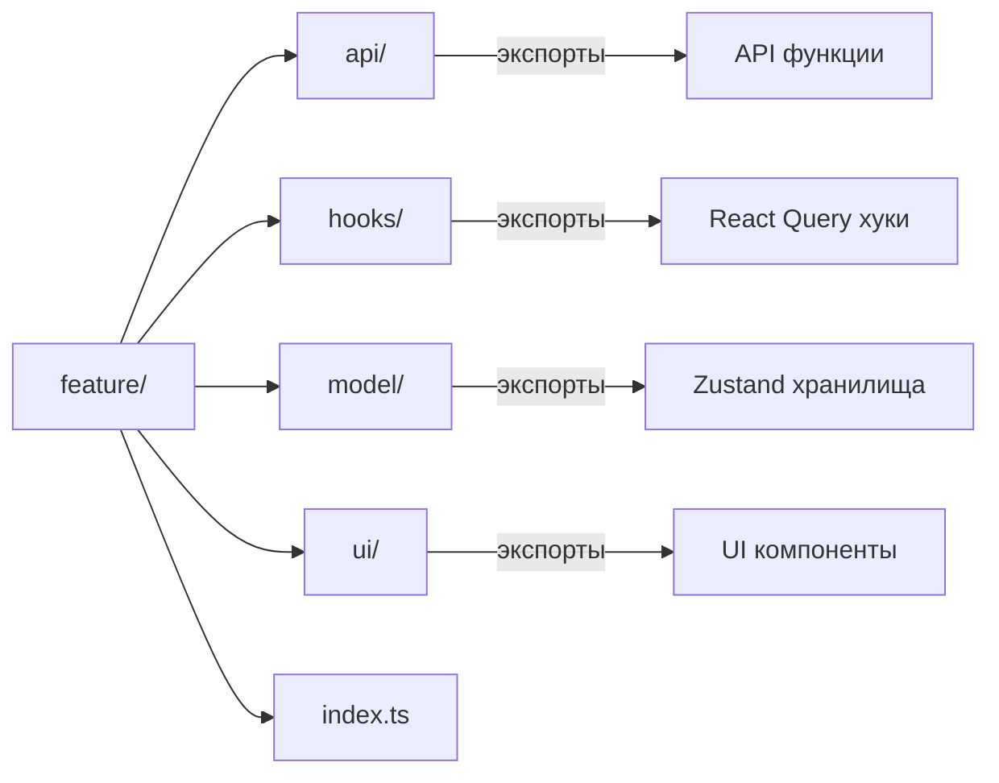
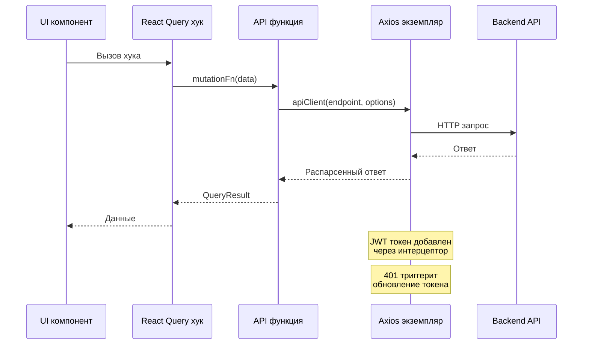
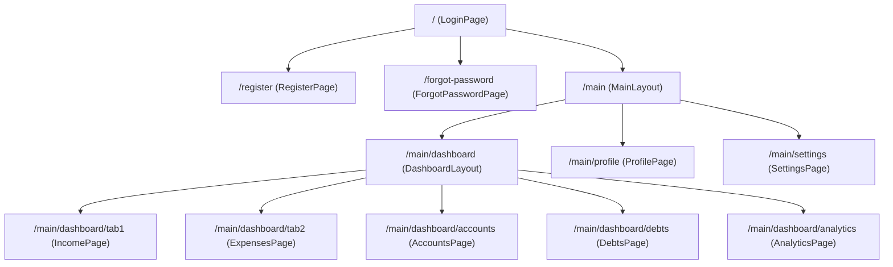
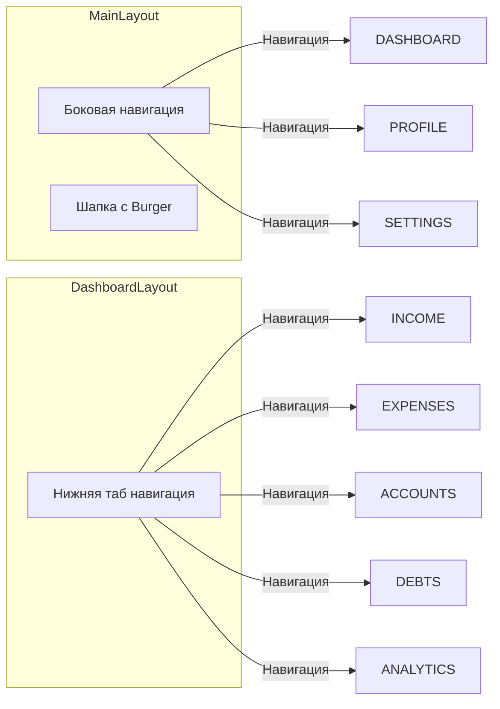
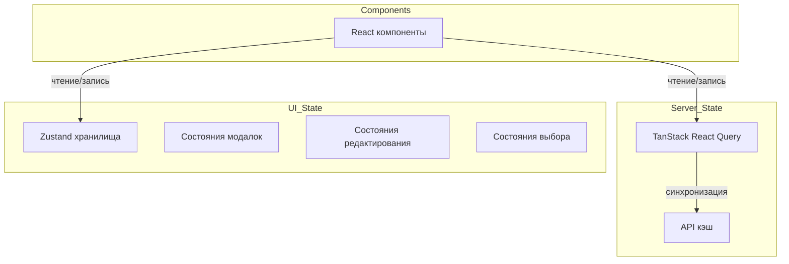
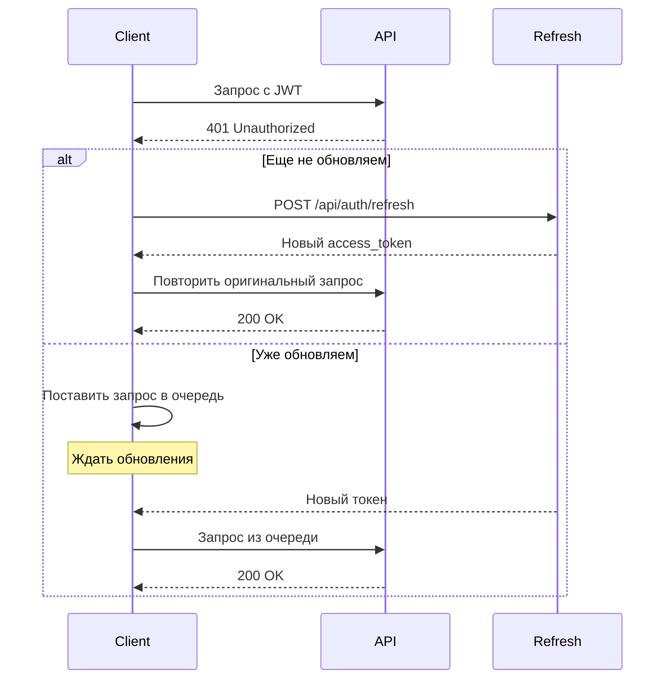
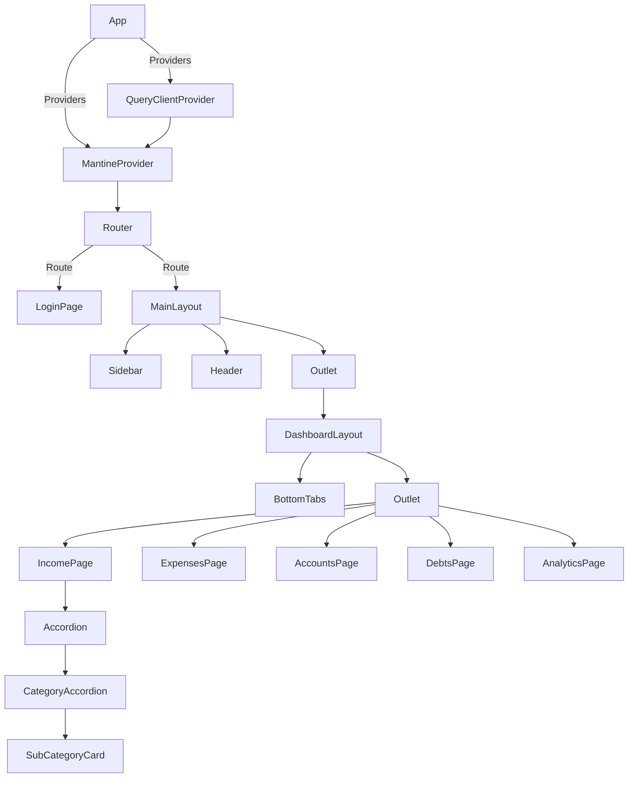

# Документация Frontend

## Оглавление

1. [Обзор](#1-обзор)
2. [Стек технологий](#2-стек-технологий)
3. [Структура проекта](#3-структура-проекта)
4. [Архитектура](#4-архитектура)
5. [Маршрутизация](#5-маршрутизация)
6. [Управление состоянием](#6-управление-состоянием)
7. [API слой](#7-api-слой)
8. [Компоненты](#8-компоненты)
9. [Типы сущностей](#9-типы-сущностей)
10. [Фичи](#10-фичи)

---

## 1. Обзор

Budget — это приложение для управления личными финансами, построенное на React. Оно позволяет пользователям отслеживать доходы, расходы, счета, долги и финансовые цели с организацией по категориям.

### Ключевые функции

- Отслеживание доходов и расходов с категориями и подкатегориями
- Управление несколькими счетами с отслеживанием баланса
- Отслеживание долгов с оставшимися суммами
- Финансовые цели с отслеживанием прогресса
- Аналитика и отчетность
- Аутентификация через Google OAuth
- Поддержка темной и светлой темы

---

## 2. Стек технологий

| Категория | Технология | Версия |
|-----------|------------|--------|
| Фреймворк | React | 19.2.0 |
| UI библиотека | Mantine | 9.0.2 |
| Маршрутизация | React Router DOM | 7.9.4 |
| Серверное состояние | TanStack React Query | 5.99.0 |
| Клиентское состояние | Zustand | 5.0.12 |
| HTTP клиент | Axios | 1.15.1 |
| Иконки | Tabler Icons React | 3.41.1 |
| Google Auth | React OAuth Google | 0.13.5 |
| Бандлер | Vite | 8.0.0 |
| Тестирование | Vitest | 4.1.0 |
| TypeScript | TypeScript | 6.0.2 |
| Пакетный менеджер | Yarn | 4.13.0 |

---

## 3. Структура проекта

```
frontend/
├── src/
│   ├── app/                    # Точка входа приложения
│   │   ├── App.tsx             # Корневой компонент
│   │   ├── index.ts            # Экспортирует App
│   │   └── router/
│   │       ├── Router.tsx      # Определения маршрутов
│   │       └── index.ts
│   ├── main.tsx                # React DOM entry
│   ├── theme.ts                # Конфигурация темы Mantine
│   │
│   ├── pages/                  # Компоненты страниц
│   │   ├── LoginPage/
│   │   ├── RegisterPage/
│   │   ├── ForgotPasswordPage/
│   │   ├── DashboardPage/
│   │   │   ├── DashboardPage.tsx
│   │   │   ├── DashboardLayout.tsx
│   │   │   └── ui/
│   │   │       ├── IncomePage.tsx
│   │   │       ├── ExpensesPage.tsx
│   │   │       ├── AccountsPage.tsx
│   │   │       ├── DebtsPage.tsx
│   │   │       ├── AnalyticsPage.tsx
│   │   │       └── GoalsPage.tsx
│   │   ├── ProfilePage/
│   │   ├── SettingsPage/
│   │   └── MainPage/
│   │
│   ├── widgets/                # Переиспользуемые UI компоненты
│   │   ├── MainLayout/         # Оболочка приложения с сайдбаром
│   │   ├── CategoryAccordion/  # Сворачиваемый компонент категории
│   │   └── SubCategoryCard/    # Карточка подкатегории транзакций
│   │
│   ├── features/               # Бизнес-логика фич
│   │   ├── Auth/
│   │   ├── Categories/
│   │   ├── Transactions/
│   │   ├── Accounts/
│   │   ├── Debts/
│   │   ├── BudgetUI/
│   │   ├── BudgetIncome/
│   │   ├── BudgetExpense/
│   │   ├── AddCategory/
│   │   ├── AddSubCategory/
│   │   └── DeleteConfirmation/
│   │
│   ├── entities/               # Доменные модели/типы
│   │   ├── Account/
│   │   ├── Category/
│   │   ├── Transaction/
│   │   ├── Debt/
│   │   └── Goal/
│   │
│   ├── shared/                 # Общие утилиты
│   │   ├── lib/
│   │   │   └── api/
│   │   │       └── client.ts   # Axios экземпляр
│   │   └── ui/
│   │       ├── IconRenderer/
│   │       └── ColorSchemeToggle/
│   │
│   └── test/
│       └── setup.ts
├── test-utils/                # Утилиты для тестирования
├── package.json
├── tsconfig.json
├── vite.config.mjs
└── vitest.config.ts
```

### Архитектура слоев



### Ответственность директорий

| Директория | Ответственность |
|-----------|----------------|
| `pages/` | Компоненты страниц, точки назначения маршрутов |
| `widgets/` | Переиспользуемые составные UI компоненты |
| `features/` | Бизнес-логика, API вызовы, управление состоянием |
| `entities/` | TypeScript интерфейсы и типы |
| `shared/` | Кросс-cutting утилиты и примитивы UI |

---

## 4. Архитектура

### Высокоуровневая архитектура



### Паттерн модуля фичи

Каждая фича следует последовательной структуре:



### Поток данных



---

## 5. Маршрутизация

### Иерархия маршрутов



### Определения маршрутов (`src/app/router/Router.tsx`)

```typescript
const router = createBrowserRouter([
  { path: "/", element: <LoginPage /> },
  { path: "/register", element: <RegisterPage /> },
  { path: "/forgot-password", element: <ForgotPasswordPage /> },
  {
    path: "/main",
    element: <MainLayout />,
    children: [
      { index: true, element: <Navigate to="/main/dashboard" replace /> },
      {
        path: "dashboard",
        element: <DashboardLayout />,
        children: [
          { index: true, element: <Navigate to="tab1" replace /> },
          { path: "tab1", element: <IncomePage /> },
          { path: "tab2", element: <ExpensesPage /> },
          { path: "accounts", element: <AccountsPage /> },
          { path: "debts", element: <DebtsPage /> },
          { path: "analytics", element: <AnalyticsPage /> },
        ],
      },
      { path: "profile", element: <ProfilePage /> },
      { path: "settings", element: <SettingsPage /> },
    ],
  },
]);
```

### Структура навигации



---

## 6. Управление состоянием

### Архитектура состояния



### Zustand хранилища

| Хранилище | Расположение | Назначение |
|-----------|----------|---------|
| `useUIStore` | `features/BudgetUI/model/uiStore.ts` | Состояния модалок, редактирования, иконок |
| `useAccountsStore` | `features/Accounts/model/accountsStore.ts` | Состояния модалок создания/редактирования счетов |
| `useDebtsStore` | `features/Debts/model/debtsStore.ts` | Состояния модалок создания/редактирования долгов |
| `useIncomeStore` | `features/BudgetIncome/model/incomeStore.ts` | Доменное состояние страницы доходов |
| `useExpenseStore` | `features/BudgetExpense/model/expenseStore.ts` | Доменное состояние страницы расходов |

### Структура UI хранилища (`useUIStore`)

```typescript
interface UIStore {
  editingSubId: string | null;
  amountValue: string;
  hiddenSubs: Set<string>;
  mainModalOpened: boolean;
  subModalOpened: boolean;
  deleteModalOpened: boolean;
  activeMainCatId: string | null;
  newName: string;
  selectedIcon: IconName;
  itemToDelete: DeleteItem | null;
  
  // Действия
  setEditingSubId: (id: string | null) => void;
  setAmountValue: (value: string) => void;
  setNewName: (value: string) => void;
  setSelectedIcon: (icon: IconName) => void;
  openMainModal: () => void;
  closeMainModal: () => void;
  openSubModal: (catId: string) => void;
  closeSubModal: () => void;
  openDeleteModal: () => void;
  closeDeleteModal: () => void;
  toggleSubTransactions: (subId: string) => void;
}
```

### Паттерн React Query

```typescript
// Query хук
export const useCategories = () => {
  return useQuery({
    queryKey: ["categories"],
    queryFn: categoriesApi.getAll,
  });
};

// Mutation хук
export const useCreateCategory = () => {
  const queryClient = useQueryClient();
  return useMutation({
    mutationFn: (data: CreateCategoryDto) => categoriesApi.create(data),
    onSuccess: () => {
      queryClient.invalidateQueries({ queryKey: ["categories"] });
    },
  });
};
```

### Интерфейс доменного хранилища

```typescript
interface DomainStore {
  categories: MainCategory[];
  transactions: Transaction[];
  itemToDelete: DeleteItem | null;
  
  getSubTotal: (subId: string) => number;
  getMainTotal: (mainCat: MainCategory) => number;
  
  addTransaction: (subId: string, amount: number) => void;
  deleteTransaction: (id: string) => void;
  
  addMainCategory: (name: string, icon: IconName) => void;
  addSubCategory: (name: string, icon: IconName, catId: string) => void;
  
  confirmDeleteMainCategory: (catId: string) => DeleteItem | null;
  confirmDeleteSubCategory: (subId: string) => DeleteItem | null;
  setItemToDelete: (item: DeleteItem | null) => void;
  handleDeleteConfirmed: () => void;
}
```

---

## 7. API слой

### Архитектура API клиента

```mermaid
graph TB
    subgraph Request
        REQ[API функция]
        REQ_OPTIONS[Опции запроса]
    end
    
    subgraph Axios_Instance
        INT_REQ[Request интерцептор]
        INT_RES[Response интерцептор]
        QUEUE[Очередь обновления]
    end
    
    subgraph Backend
        API[/api/*]
        AUTH[/api/auth/*]
    end
    
    REQ --> INT_REQ
    INT_REQ -->|Добавить JWT| API
    API --> INT_RES
    INT_RES -->|401| QUEUE
    QUEUE -->|Обновить| AUTH
    AUTH -->|Новый токен| QUEUE
    INT_RES --> REQ
```

### Конфигурация Axios (`src/shared/lib/api/client.ts`)

```typescript
const apiClientInstance = axios.create({
  baseURL: '/api',
  headers: { 'Content-Type': 'application/json' }
});

// Request interceptor: добавить JWT токен
apiClientInstance.interceptors.request.use((config) => {
  const token = localStorage.getItem('access_token');
  if (token) config.headers.Authorization = `Bearer ${token}`;
  return config;
});

// Response interceptor: обработать 401 с обновлением токена
apiClientInstance.interceptors.response.use(
  (response) => response,
  async (error) => {
    const originalRequest = error.config;
    
    if (error.response?.status === 401 && !originalRequest._retry) {
      // Логика обновления токена с очередью
      // ...
    }
  }
);
```

### Паттерн API модуля

```typescript
// features/Categories/api/index.ts
export const categoriesApi = {
  getAll: () => apiClient<CategoryApi[]>("/categories", { method: "GET" }),
  getById: (id: number) => apiClient<CategoryApi>(`/categories/${id}`),
  create: (data: CreateCategoryDto) => 
    apiClient<CategoryApi>("/categories", { method: "POST", body: data }),
  update: (id: number, data: UpdateCategoryDto) => 
    apiClient<CategoryApi>(`/categories/${id}`, { method: "PATCH", body: data }),
  delete: (id: number) => 
    apiClient<void>(`/categories/${id}`, { method: "DELETE" }),
};
```

### Поток обновления токена



### Обработка исключений

```typescript
export interface ApiError {
  errors?: Record<string, string>;
  message?: string;
}

export class ApiException extends Error {
  constructor(public readonly errorData: ApiError) {
    super(errorData.message || 'API Error');
    this.name = 'ApiException';
  }
}
```

---

## 8. Компоненты

### Иерархия компонентов



### Main Layout (`src/widgets/MainLayout/MainLayout.tsx`)

Основная оболочка приложения с адаптивной боковой навигацией.

```typescript
export function MainLayout() {
  const [sidebarOpened, setSidebarOpened] = useState(true);
  const [drawerOpened, setDrawerOpened] = useState(false);
  const isMobile = useMediaQuery("(max-width: 48em)");
  
  // Desktop: постоянный сайдбар
  // Mobile: выдвижная навигация
}
```

**Функции:**
- Адаптивный сайдбар (drawer на мобильных)
- Переключение темы (светлая/темная)
- Функция выхода
- Навигация через `react-router-dom`

### Dashboard Layout (`src/pages/DashboardPage/DashboardLayout.tsx`)

Контейнер дашборда с нижней таб-навигацией.

```typescript
export function DashboardLayout() {
  const navItems = [
    { icon: <IconWallet />, path: "/main/dashboard/tab1", label: "Доходы" },
    { icon: <IconShoppingCart />, path: "/main/dashboard/tab2", label: "Расходы" },
    { icon: <IconCreditCard />, path: "/main/dashboard/accounts", label: "Счета" },
    { icon: <IconReceipt />, path: "/main/dashboard/debts", label: "Долги" },
    { icon: <IconChartBar />, path: "/main/dashboard/analytics", label: "Аналитика" },
  ];
}
```

### Category Accordion (`src/widgets/CategoryAccordion/ui/CategoryAccordion.tsx`)

Сворачиваемый компонент категории с подкатегориями.

```typescript
interface CategoryAccordionProps {
  cat: MainCategory;
  store: DomainStore;
}
```

**Функции:**
- Accordion элемент с иконкой и итого
- Кнопка добавления подкатегории
- Удаление категории с подтверждением
- Список компонентов `SubCategoryCard`

### Sub Category Card (`src/widgets/SubCategoryCard/ui/SubCategoryCard.tsx`)

Интерактивная карточка для транзакций подкатегории.

```typescript
interface SubCategoryCardProps {
  sub: SubCategory;
  store: DomainStore;
}
```

**Функции:**
- Клик для добавления суммы транзакции
- Встроенный числовой ввод с сохранением при blur/enter
- Раскрытие/скрытие транзакций
- Удаление подкатегории
- Расчет итого в реальном времени

### Компоненты иконок (`src/shared/ui/IconRenderer/`)

```typescript
interface IconRendererProps {
  name: IconName;
  size?: number;
}

interface IconSelectorProps {
  value: IconName;
  onChange: (icon: IconName) => void;
}
```

**Доступные иконки:**
- `food`, `coffee`, `shop`, `home`, `car`, `health`, `entertainment` и др.

---

## 9. Типы сущностей

### Category (`src/entities/Category/model/types.ts`)

```typescript
interface SubCategory {
  id: string;
  name: string;
  iconName: IconName;
}

interface MainCategory {
  id: string;
  name: string;
  iconName: IconName;
  subCategories: SubCategory[];
}
```

### Transaction (`src/entities/Transaction/model/types.ts`)

```typescript
interface Transaction {
  id: string;
  subCategoryId: string;
  amount: number;
  at: Date;
}
```

### Account (`src/entities/Account/model/types.ts`)

```typescript
interface Account {
  id: number;
  name: string;
  balance: number;
  icon: IconName | null;
  target_amount: number | null;
}

interface CreateAccountDto {
  name: string;
  balance?: number;
  icon?: IconName;
  target_amount?: number;
}

interface UpdateAccountDto {
  name?: string;
  balance?: number;
  icon?: IconName;
  target_amount?: number;
}
```

### Debt (`src/entities/Debt/model/types.ts`)

```typescript
interface Debt {
  id: number;
  name: string;
  total_debt: number;
  remaining_debt: number;
  icon: IconName | null;
}

interface CreateDebtDto {
  name: string;
  total_debt: number;
  remaining_debt?: number;
  icon?: IconName;
}

interface UpdateDebtDto {
  name?: string;
  total_debt?: number;
  remaining_debt?: number;
  icon?: IconName;
}
```

### Goal (`src/entities/Goal/model/types.ts`)

```typescript
interface Goal {
  id: number;
  name: string;
  current_amount: number;
  target_amount: number;
}

interface CreateGoalDto {
  name: string;
  target_amount: number;
  current_amount?: number;
}

interface UpdateGoalDto {
  name?: string;
  current_amount?: number;
  target_amount?: number;
}
```

---

## 10. Фичи

### Auth (`src/features/Auth/`)

Функциональность аутентификации, включая вход, регистрацию и Google OAuth.

```typescript
// API функции
login.ts       // POST /api/auth/login
register.ts    // POST /api/auth/register
googleAuth.ts  // Google OAuth интеграция

// Model (Zustand хранилища)
login.ts       // Состояние формы входа
register.ts    // Состояние формы регистрации
```

### Categories (`src/features/Categories/`)

Управление категориями с CRUD операциями.

```typescript
// API
interface CategoryApi {
  id: number;
  name: string;
  type: "income" | "expense";
  icon: string;
  parent: CategoryApi | null;
  children: CategoryApi[];
}

// Хуки
useCategories()           // Получить все категории
useCategory(id)          // Получить одну категорию
useCreateCategory()      // Мутация создания категории
useUpdateCategory()      // Мутация обновления категории
useDeleteCategory()      // Мутация удаления категории

// Утилиты
mapCategoriesToMain()     // Трансформировать API ответ в MainCategory[]
```

### Transactions (`src/features/Transactions/`)

Управление транзакциями.

```typescript
// Хуки
useTransactions()           // Получить все транзакции
useCreateTransaction()      // Мутация создания транзакции
useDeleteTransaction()      // Мутация удаления транзакции
```

### Accounts (`src/features/Accounts/`)

Управление счетами с отслеживанием баланса.

```typescript
// Хранилище
useAccountsStore = {
  // Состояние модалки создания
  createModalOpened: boolean
  newAccountName: string
  newAccountBalance: number
  newAccountTarget: number
  selectedIcon: IconName
  
  // Состояние модалки редактирования
  editModalOpened: boolean
  editingAccount: Account | null
  
  // Действия
  openCreateModal()
  closeCreateModal()
  openEditModal(account)
  closeEditModal()
  setNewAccountName(name)
  setNewAccountBalance(balance)
  setNewAccountTarget(target)
  setSelectedIcon(icon)
}
```

### Debts (`src/features/Debts/`)

Отслеживание долгов с прогрессом платежей.

```typescript
// Хранилище
useDebtsStore = {
  // Состояние модалки создания
  createModalOpened: boolean
  
  // Состояние модалки редактирования
  editModalOpened: boolean
  editingDebt: Debt | null
  
  // Действия
  openCreateModal()
  closeCreateModal()
  openEditModal(debt)
  closeEditModal()
}
```

### BudgetUI (`src/features/BudgetUI/`)

Управление общим UI состоянием для страниц бюджета.

```typescript
// Типы
interface DeleteItem {
  type: "category" | "subcategory"
  id: string
  name: string
  transactionsCount: number
}

interface Transaction {
  id: string
  subCategoryId: string
  amount: number
  at: Date
}

interface DomainStore {
  categories: MainCategory[]
  transactions: Transaction[]
  itemToDelete: DeleteItem | null
  // ... методы
}
```

### AddCategory (`src/features/AddCategory/`)

Модалка для создания основных категорий.

```typescript
interface AddCategoryModalProps {
  addMainCategory: (name: string, icon: IconName, type: "income" | "expense") => void
  type: "income" | "expense"
}
```

### AddSubCategory (`src/features/AddSubCategory/`)

Модалка для создания подкатегорий под родительской категорией.

```typescript
interface AddSubCategoryModalProps {
  addSubCategory: (name: string, icon: IconName, catId: string) => void
}
```

### DeleteConfirmation (`src/features/DeleteConfirmation/`)

Модалка подтверждения удаления категорий/подкатегорий.

```typescript
interface DeleteConfirmationModalProps {
  store: DomainStore
}
```

---

## Приложение: Конфигурация

### Vite Config (`vite.config.mjs`)

- React плагин включен
- Проксирование API запросов на `http://localhost:3000`
- Тестовое окружение: jsdom с Vitest
- Псевдонимы путей TypeScript через `tsconfigPaths`

### TypeScript Config (`tsconfig.json`)

- Целевой уровень ESNext
- Псевдонимы путей: `@/*` -> `./src/*`
- React JSX transform
- Строгий режим включен

### Псевдонимы путей

| Псевдоним | Путь |
|-----------|------|
| `@/*` | `./src/*` |

---

## Приложение: Тестирование

### Настройка тестов

- **Фреймворк**: Vitest с React Testing Library
- **Конфиг**: `vitest.config.ts`
- **Setup**: `vitest.setup.mjs`
- **Утилиты**: `test-utils/render.tsx`

### Паттерн тестовых файлов

```typescript
// *.spec.tsx файлы
import { render, screen } from '@/test-utils/render'
import { describe, it, expect } from 'vitest'

describe('Component', () => {
  it('рендерится корректно', () => {
    render(<Component />)
    expect(screen.getByText('Контент')).toBeInTheDocument()
  })
})
```
