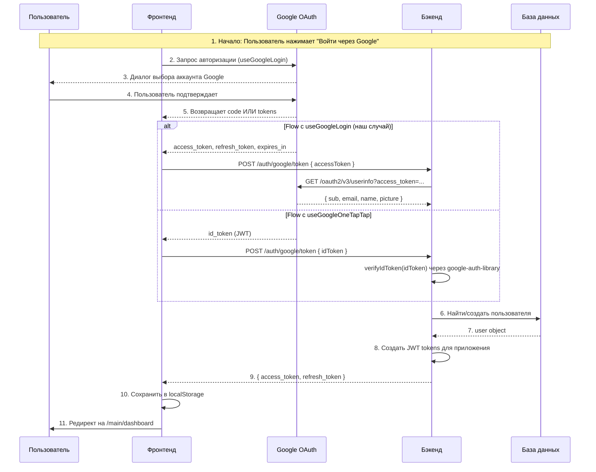
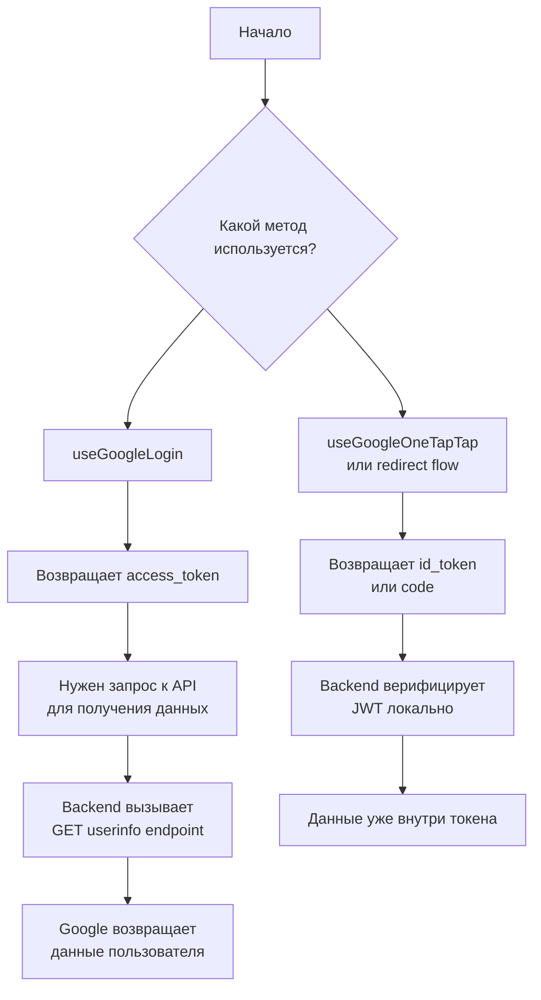

# Google OAuth Fix - Before & After

## Проблема

`@react-oauth/google` с хуком `useGoogleLogin` возвращает **access_token**, НЕ **id_token**.

| Токен | Описание | Как верифицировать |
|--------|----------|-------------------|
| `id_token` | JWT токен | Локально через `google-auth-library.verifyIdToken()` |
| `access_token` | OAuth токен доступа | Запрос к Google API (`/oauth2/v3/userinfo`) |

Бэкенд пытался верифицировать `access_token` через `verifyIdToken()` - это вызывало ошибку.

---

## Теория: Как работает OAuth 2.0 с Google

### Два типа токенов Google

**1. ID Token (JWT)**
- Содержит зашифрованные данные пользователя внутри
- Можно верифицировать локально без запросов к Google
- Используется для аутентификации (кто этот пользователь)
- Формат: `header.payload.signature`

**2. Access Token**
- Не содержит данных пользователя
- Это просто "ключ" для доступа к Google API
- Для получения данных нужно сделать запрос к API с этим токеном
- Имеет срок действия (обычно 1 час)

### Схема OAuth 2.0 Flow с Google



### Два сценария Google OAuth



---

## Изменения

### 1. Фронтенд: `googleAuth.ts`

**Было:**
```typescript
export async function googleAuthApi(idToken: string): Promise<GoogleTokenResponse> {
  return apiClient<GoogleTokenResponse>("/auth/google/token", {
    method: "POST",
    body: { googleToken: idToken },  // ❌ отправлял id_token
  });
}
```

**Стало:**
```typescript
export async function googleAuthApi(accessToken: string): Promise<GoogleTokenResponse> {
  return apiClient<GoogleTokenResponse>("/auth/google/token", {
    method: "POST",
    body: { accessToken },  // ✅ отправляет access_token
  });
}
```

---

### 2. Фронтенд: `LoginPage.tsx`

**Было:**
```typescript
const response = await googleAuthApi(tokenResponse.id_token);  // ❌
```

**Стало:**
```typescript
const response = await googleAuthApi(tokenResponse.access_token);  // ✅
```

---

### 3. Бэкенд: `auth.controller.ts`

**Было:**
```typescript
async googleToken(@Body() body: { googleToken: string }) {
  const { googleToken } = body;
  return this.authService.verifyGoogleToken(googleToken);  // ❌
}
```

**Стало:**
```typescript
async googleToken(@Body() body: { accessToken: string }) {
  const { accessToken } = body;
  return this.authService.verifyGoogleAccessToken(accessToken);  // ✅
}
```

---

### 4. Бэкенд: `auth.service.ts`

**Было (не работало):**
```typescript
async verifyGoogleToken(googleToken: string): Promise<ITokenResponse> {
  const { OAuth2Client } = require('google-auth-library');
  const client = new OAuth2Client(clientId);

  const ticket = await client.verifyIdToken({
    idToken: googleToken,  // ❌ access_token не является id_token
    audience: clientId,
  });

  const payload = ticket.getPayload();
  // ...
}
```

**Стало (работает):**
```typescript
async verifyGoogleAccessToken(accessToken: string): Promise<ITokenResponse> {
  // Запрос к Google API для получения данных пользователя
  const response = await fetch(
    `https://www.googleapis.com/oauth2/v3/userinfo?access_token=${accessToken}`
  );

  const userInfo = await response.json();

  const googleUser = {
    googleId: userInfo.sub,
    email: userInfo.email,
    username: userInfo.name || userInfo.email,
    avatar: userInfo.picture,
  };

  return this.googleLogin(googleUser);
}
```

---

## Почему это помогло

| Шаг | Описание |
|-----|----------|
| 1 | Фронтенд получает `access_token` от Google через `useGoogleLogin` |
| 2 | Отправляет `access_token` на бэкенд |
| 3 | Бэкенд делает запрос к `https://www.googleapis.com/oauth2/v3/userinfo?access_token=...` |
| 4 | Google API возвращает данные пользователя (`sub`, `email`, `name`, `picture`) |
| 5 | Бэкенд создаёт/находит пользователя в БД и возвращает JWT токены приложения |

Это стандартный OAuth 2.0 flow - токен доступа используется для запроса защищённых ресурсов (данных пользователя).

---

## Дополнительная информация: Endpoints Google OAuth

| Endpoint | Описание |
|----------|----------|
| `https://oauth2.googleapis.com/token` | Обмен code на tokens |
| `https://www.googleapis.com/oauth2/v3/userinfo` | Получение данных пользователя |
| `https://accounts.google.com/.well-known/openid-configuration` | OIDC discovery document |

### Userinfo Response

```json
{
  "sub": "123456789",           // Уникальный ID Google
  "email": "user@gmail.com",    // Email
  "email_verified": true,       // Верифицирован ли email
  "name": "Иван Петров",        // Полное имя
  "picture": "https://...",      // Аватар
  "locale": "ru"                // Язык
}
```
